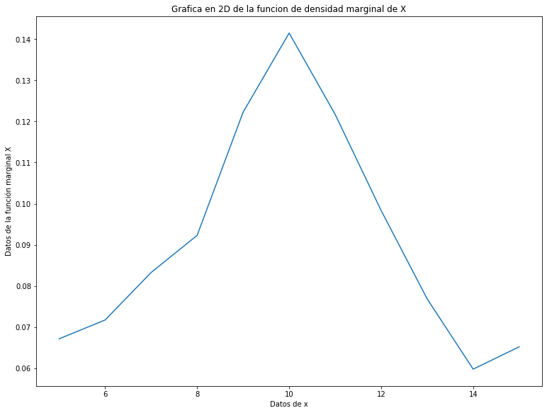
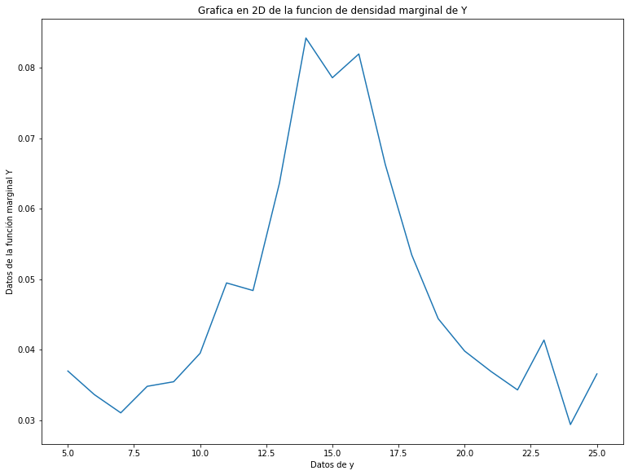
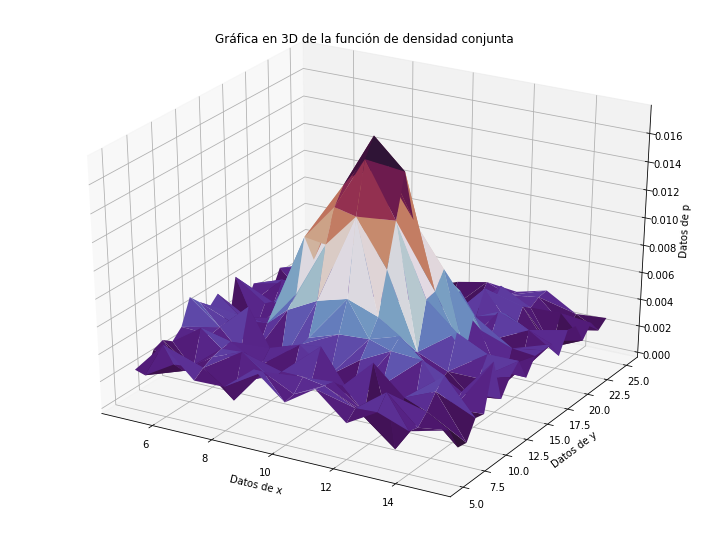

---
## Universidad de Costa Rica

### Escuela de Ingeniería Eléctrica

#### IE0405 - Modelos Probabilísticos de Señales y Sistemas
---
---
## Tarea 3: Variables Aleatorias Múltiples

### Pierre Durán Guzmán
### B42323
#### Grupo 01
---
### Pregunta 1)
Consiste en que, a partir de los datos csv brindados, se debe de encontrar la mejor curva de ajuste (modelo probabilístico) para las funciones de densidad marginales de X y Y. Para ello, inicialmente se procede a importar y delimitar los datos brindados en los archivos `xy.csv` y `xyp.csv` que serán los utilizados para realizar los cálculos que se solicitan en esta tarea.

Seguidamente, necesitamos encontrar las funciones de densidad marginales de X y Y a partir de los datos x y y. Para calcular X se hace la suma de probabilidades a lo largo de y y para Y se hace la sumatoria a lo largo de x, obteniendo así, vectores que representan las funciones de densidad marginales de cada uno de los datos. Luego, se grafica las funciones X y Y con sus respectivos vectores de x y y con el fin de observar la forma general que presenta la curva y así, establecer cuál es la mejor curva de ajuste para dichas funciones. Una vez hecho esto, se observa que la mejor curva de ajuste puede ser la Gaussiana, por lo tanto, se procede a determinar la función de la distribución Gaussiana y obtener los parámetros mu y sigma de las funciones X y Y teniendo:
* Los parametros de ajuste mu y sigma de la curva Gaussiana de X son: [9.90484381 3.29944288]
* Los parametros de ajuste mu y sigma de la curva Gaussiana de Y son: [15.0794609   6.02693776]

Y, a partir de estos parámetros obtenidos, se grafica las curvas Gaussianas obteniendo:

Donde podemos apreciar que efectivamente la distribución Gaussiana corresponde a la mejor curva de ajuste de las funciones de densidad marginales de X y Y, debido a que ambos modelos obtenidos son muy similares a las curvas reales de las funciones (las cuales podemos observar en la pregunta 4).

###  Pregunta 2)
Consiste en asumir independencia de X y Y. Por ende, se necesita determinar analíticamente, ¿cuál es entonces la expresión de la función de densidad conjunta que modela los datos?

Para ello, debemos de suponer que las funciones de densidad marginales X y Y son estadísticamente independientes y esto se da, si y solo si, la probabilidad del evento conjunto de ambos es igual al producto de las probabilidades de ambas variables independientes. Es por ello que, para calcular la función de densidad conjunta que modela los datos se calcula de la forma: 

Teniendo que, los modelos de las funciones de densidad marginales obtenidas en la pregunta 1 son:

Por lo tanto, se establece que la función de densidad conjunta va estar dada por el producto de las funciones de densidad marginales de x y y (X y Y), anteriormente mostradas. Por lo que se obtiene que: 

Donde, 

tal y como se obtuvo en la pregunta 1.

### Pregunta 3)
Para esta pregunta, se debe hallar los valores de correlación, covarianza y coeficiente de correlación (Pearson) para los datos y explicar su significado. 

Primeramente, debemos hallar la correlación de los datos. La correlación es el momento de segundo orden m11 = E[XY]=Rxy el cual consiste en el grado en el cual dos o más cantidades están linealmente asociadas. Una vez sabiendo lo que significa el término de correlación, se procede a calcularlo de la forma: Correlación es igual a la sumatoria de la multiplicación de los datos x por y y por la probabilidad conjunta. Esta sumatoria se hace para cada fila de datos de todos los x con todos los y y sus probabilidades asociadas. Con el fin de simplificar este calculo, se usa el archivo `xyp.csv` el cual es más fácil de manejar para este calculo ya que se debe de recorrer cada fila y realizar el producto de los datos y sumar su resultado para obtener la correlación como resultado total de la suma. De esta manera, se obtiene que: 

El valor de correlación de los datos es: 149.54281000000012

Seguidamente, se procede a calcular la covarianza, la cual se define como el valor que indica el grado de variación conjunta de dos variables aleatorias respecto a sus medias. Se caracteriza por ser el momento conjunto de segundo orden de dos variables aleatorias y se le conoce como Cxy. Una vez sabiendo esto, se procede a calcular la covarianza para las variables X y Y. Se calcula de la forma que la covarianza sea igual a la correlación menos el productos de los valores esperados o medias de X y de Y, que para este caso, como el modelo de las funciones es Guassiana entonces las medias corresponden al valor de mu calculados en la pregunta 1. De esta manera se obtiene que:

El valor de la covarianza de los datos es: 0.183105046498099

Lo que significa que se presenta una dependencia directa (postiva) donde a grandes valores de x corresponden grandes valores de y.

Por último, se necesita calcular el coeficiente de correlación (Pearson), que es el momento de segundo orden normalizado  el cual consiste en una medida estadística que cuantifica la dependencia lineal entre dos variables, es decir, puede utilizarse para medir el grado de relación de dos variables. Este coeficiente se calcula de la forma que el valor obtenido de la covarianza se divide entre el producto de las desviaciones estándar de las variables X y Y, es decir, entre el producto de los sigmas de cada variable. Por ende, al realizar este cálculo se obtiene que:

El valor del coeficiente de correlación (Pearson) es: 0.009207950863939269

Lo que significa que existe una correlación positiva entre las variables X y Y.

### Pregunta 4)

Consiste en graficar las funciones de densidad marginales (2D), la función de densidad conjunta (3D). Para ello, para las gráficas en 2D de cada función de densidad marginal se procede a "plotear" los vectores calculados en la pregunta 1) que representan la función de densidad marginal tanto de X como de Y. Estos vectores X y Y se grafican respecto a vectores xs y ys que van de 5 a 15 y de 5 a 25, respectivamente, obteniendo así, las siguientes gráficas:

Donde podemos apreciar que ambas presentan una forma de curva muy similar a la curva de la distribución Gaussiana (forma de campana) por ende, es que en la pregunta 1 se procede a calcular el modelo de la curva de ajuste a partir de la Gaussiana.

Por último, para obtener la gráfica en 3D de la función de densidad conjunta se declaran los vectores x3 que son los datos x brindados, y3 que posee los datos y brindados y los datos z3 que posee la probabilidad conjunta de ambos datos. Posteriormente, se procede a realizar el gráfico en 3D de los datos de cada vector o de cada dato para obtener la siguiente figura:

Donde podemos apreciar, según el plano que se observe, las curvas de X y Y anteriormente gráficadas.
