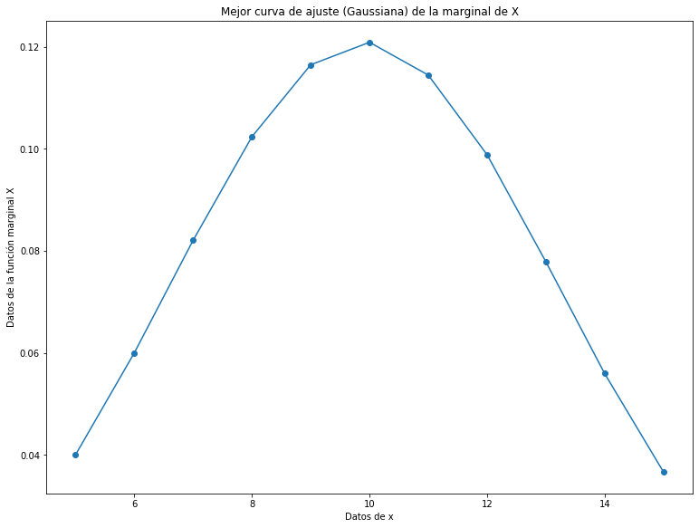
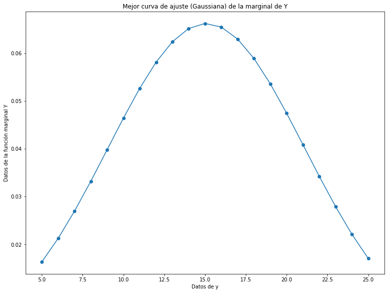

---
## Universidad de Costa Rica

### Escuela de Ingeniería Eléctrica

#### IE0405 - Modelos Probabilísticos de Señales y Sistemas
---
---
## Tarea 3: Variables Aleatorias Múltiples

### Pierre Durán Guzmán
### B42323
#### Grupo 01
---
### Pregunta 1)
Consiste en que, a partir de los datos csv brindados, se debe de encontrar la mejor curva de ajuste (modelo probabilístico) para las funciones de densidad marginales de X y Y. Para ello, inicialmente se procede a importar y delimitar los datos brindados en los archivos `xy.csv` y `xyp.csv` que serán los utilizados para realizar los cálculos que se solicitan en esta tarea.

Seguidamente, necesitamos encontras las funciones de densidad marginales de X y Y a partir de los datos x y y. Para ello, para calcular X se hace la suma de probabilidades a lo largo de y y para Y se hace la sumatoria a lo largo de x, obteniendo así, vectores que representan las funciones de densidad marginales de cada uno de los datos. Luego, se grafica las funciones X y Y con sus respectivos vectores de x y y con el fin de observar la forma general que presenta la curva y así, establecer cuál es la mejor curva de ajuste para dichas funciones. Una vez hecho esto, se observa que la mejor curva de ajuste puede ser la Gaussiana, por lo tanto, se procede a determinar la función de la distribución Gaussiana y obtener los parámetros mu y sigma de las funciones X y Y teniendo:
* Los parametros de ajuste mu y sigma de la curva Gaussiana de X son: [9.90484381 3.29944288]
* Los parametros de ajuste mu y sigma de la curva Gaussiana de Y son: [15.0794609   6.02693776]

Y, a partir de estos parámetros obtenidos, se grafica las curvas Gaussianas obteniendo:

Donde podemos apreciar que efectivamente la distribución Gaussiana corresponde a la mejor curva de ajuste de las funciones de densidad marginales de X y Y, debido a que ambos modelos obtenidos son muy similares a las curvas reales de las funciones (las cuales podemos observar en el punto 4).

###  Pregunta 2)
Consiste en asumir independencia de X y Y. Por ende, se necesita determinar analíticamente, ¿cuál es entonces la expresión de la función de densidad conjunta que modela los datos?

Para ello, debemos de suponer que las funciones de densidad marginales X y Y son estadísticamente independientes y esto se da, si y solo si, la probabilidad del evento conjunto de ambos es igual al producto de las probabilidades de ambas variables independientes. Es por ello que, para calcular la función de densidad conjunta que modela los datos se calcula de la forma: 

fx,y(x,y)=fx(x)fy(y)

Es decir, la función de densidad conjunta va estar dada por el producto de las funciones de densidad marginales de x y y (X y Y).

### Pregunta 3)
Para esta pregunta, se debe hallar los valores de correlación, covarianza y coeficiente de correlación (Pearson) para los datos y explicar su significado. 

Primeramente, debemos hallar la correlación de los datos. Para ello, la correlación es el momento de segundo orden m11 = E[XY] el cual consiste en el grado en el cual dos o más cantidades están linealmente asociadas. Una vez sabiendo lo que significa el término de correlación, se procede a calcularlo de la forma:

Correlación es igual a la sumatoria de la multiplicación de los datos x por y y por la probabilidad conjunta. Esta sumatoria se hace para cada fila de datos
